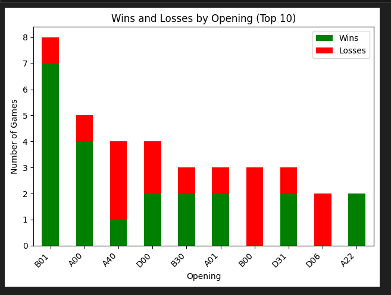

# Licheats - Lichess Data Retrieval and Analysis

## Resumen del Proyecto

**Licheats** es un sistema diseñado para la visualización y análisis de estadísticas de oponentes de ajedrez en línea en la plataforma Lichess. Este sistema permite almacenar y gestionar información sobre jugadores y partidas de ajedrez en una base de datos estructurada, con métodos adicionales para la visualización y gestión de datos.

### Objetivos del Proyecto
El objetivo principal del proyecto es desarrollar un sistema integral que permita:
- Analizar y visualizar estadísticas de partidas de ajedrez de ciertos rivales.
- Investigar las preferencias de los rivales: piezas, lado de enroque, aperturas, etc
- Investigar las efectividad de diferentes aperturas de ajedrez de los rivales.
- Prever las mejores estrategias de apertura para enfrentamientos específicos.


### Ejemplo


### Preguntas Clave a Responder

El sistema está diseñado para responder a preguntas específicas relacionadas con hábitos, estilo y comportamiento de los jugadores:

    ¿El jugador tiende a enrocarse? En caso afirmativo, ¿hacia qué lado prefiere enrocarse?
    ¿El jugador tiene un mejor desempeño con la presencia de damas en el tablero o sin ellas?
    ¿Cuáles son las causas más comunes de las derrotas del jugador (tiempo, abandono, jaque mate)?
    ¿Cómo suele ganar el jugador sus partidas (por tiempo, por abandono del oponente, por jaque mate)?
    ¿El jugador tiene un mejor rendimiento jugando con las piezas blancas o negras?
    ¿Cómo afecta la presión del tiempo al rendimiento del jugador?
    ¿Cuál es la preferencia del jugador respecto al ritmo de juego (rápidas, blitz, estándar)?

Además, se analizan estadísticas específicas de aperturas, como:

    Apertura con más victorias jugando con blancas.
    Apertura con más victorias jugando con negras.
    Apertura con más derrotas jugando con negras.


### Uso

```python
from licheats import Client

# Ejemplo de uso del cliente
client = Client()

# Obtener información del jugador 'Fieber69'
player_info = client.get_player('Fieber69')
print(player_info)

# Obtener las partidas del jugador 'Fieber69'
player_games = client.get_games('Fieber69')
print(player_games)

# Guardar la información del jugador y las partidas
client.save_player(player_info)
client.save_games(player_games)
``````